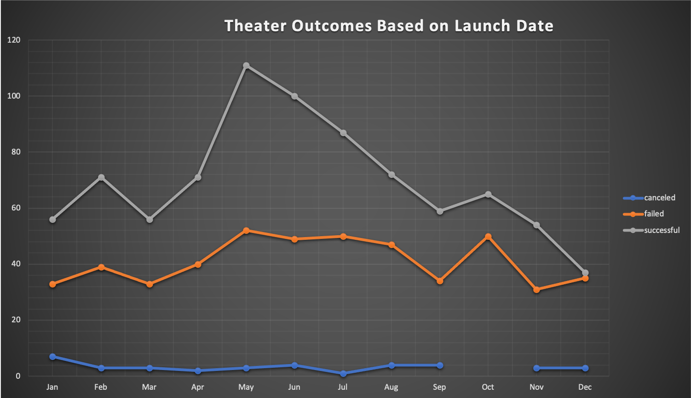
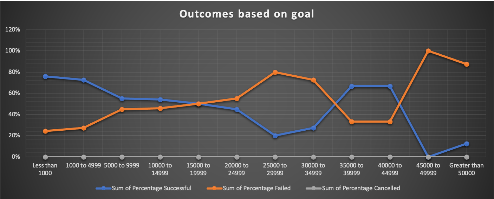

# Kickstarting with Excel

## Overview of Project

We have data of kickstarter campaigns around the world from 2009 to 2017 in a variety of categories. We focused our analysis in the Theater category, specifically Plays subcategory and also campaigns launched in the United States.

### Purpose

The purpose of the analysis is to uncover valuable insights that help our client in the US launch her campaign in the Plays subcategory and achieve success.

## Analysis and Challenges

After a kickstarter campaign is launched it will have different outcomes. It can be successful, fail, or be cancelled.  We will be analyzing how different outcomes are influenced by the goal amount of the campaign and the month the campaign is launched.  We used excel, specifically pivot tables, pivot charts, and advanced filters, and functions.

### Analysis of Outcomes Based on Launch Date

*The most successful kickstarter campaigns were started in May.  On the other hand, December does not seem like a great time to launch a campaign.

### Analysis of Outcomes Based on Goals

* There is a relationship in between the goal amount of the campaign and the outcome.  As the goal amount of the campaign increases, the probability to achieve success decreases.

* 76% of the campaigns that had a goal less than $1,000 were successful, whereas 100% of campaigns with goals in a range of $45000-$49000 failed.

### Challenges and Difficulties Encountered

There are outliers in the data.  Some campaigns have extremely high goals and this makes it harder to stronger relationships and tendencies.

## Results

- The most successful kickstarter campaigns were started in May.  On the other hand, December does not seem like a great time to launch a campaign.

- There is a relationship in between the goal amount of the campaign and the outcome.  As the goal amount of the campaign increases, the probability to achieve success decreases. 76% of the campaigns that had a goal less than $1,000 were successful, whereas 100% of campaigns with goals in a range of $45000-$49000 failed.

- There are outliers in the data.  Some campaigns have extremely high goals and this makes it harder to find relationships and tendencies. We recommend analyzing in detail the extreme data points to understand if they are relevant for the study.

- Other possible tables and/or graphs that we could create:
  *We can analyze year by year and find if there is a tendency for decrease in the funding for kickstarter campaigns.
  *We can determine how much people have pledged to campaigns historically by analyzing pledged amount and backers count.  This will help us to find incentives for our client's campaign.
  *We might want to analyze successful campaigns in the range of our client's budget to determine patterns.
  *We can analyze the date launched and deadline of successful campaings to determine wheter the campaign lenght impacts success.
